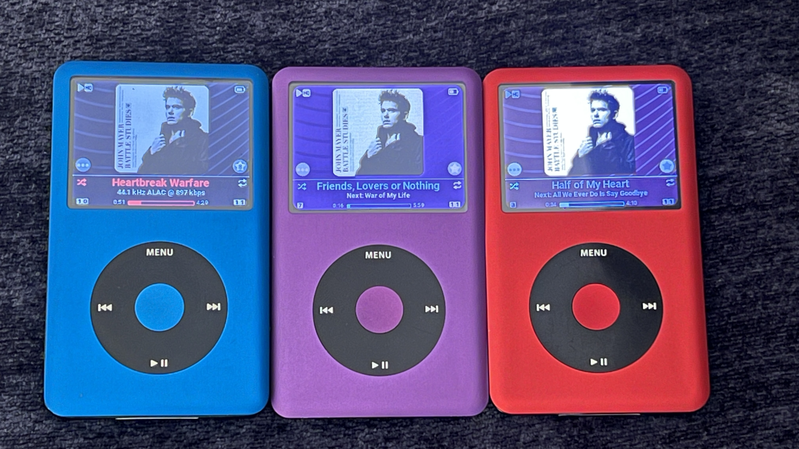
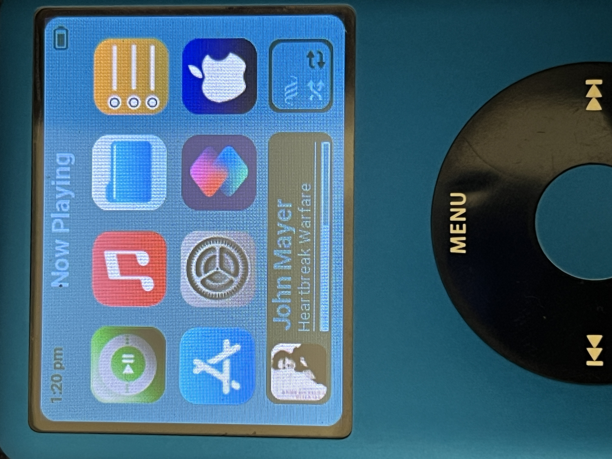
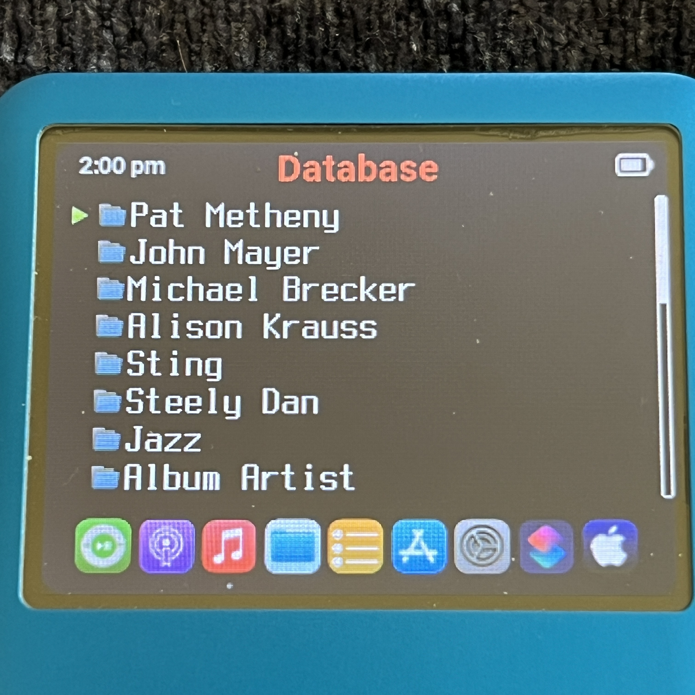
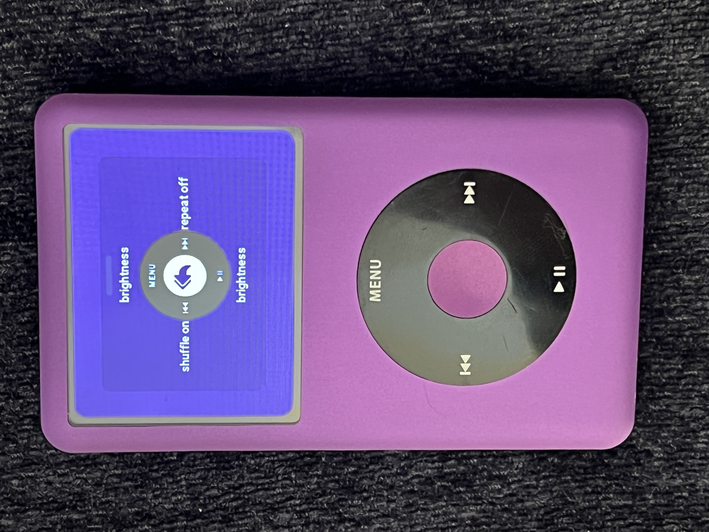
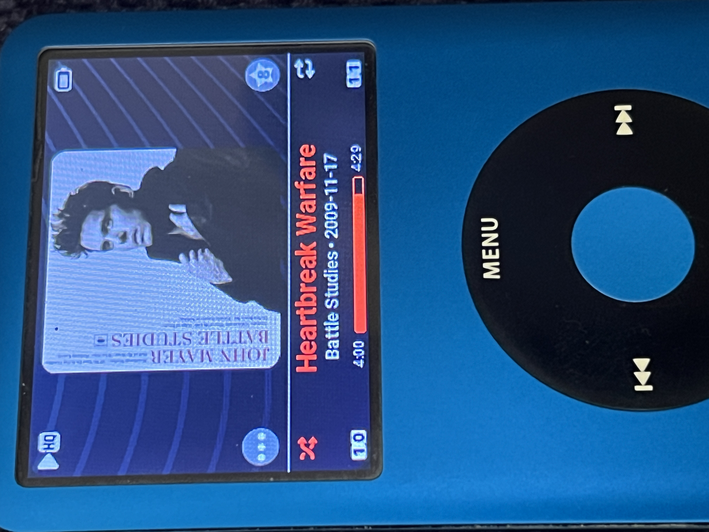

Welcome to Chroma BETA (expect issues, please)

Chroma is a Rockbox theme built around the idea of giving you extensive color and feature choices. Rather than creating separate themes for light, dark and so on, Chroma gives you nearly unlimited choice over background, foreground, and accent coloration. This is because it uses almost no bitmaps, and the bitmaps that *are* used have alpha. This gives the user thousands of combinations all in the same theme. You can see a superb implementation of the approach in d00k's Themify.

In addition to color variety, Chroma makes extensive use of Shortcuts to give you the ability to turn various features on/off. This is done by accessing the lesser-used settings in Rockbox and reapplying them to various theme settings. I learned of this idea from d00k in his adwaitapod series and it is a brilliant way to give the user maximum flexibility in how the theme works for them personnally.

The sbs screen (which I'm calling the Desktop) is based on tiles, used cleverly in themes like iRetro and NeoBeat. Each tile is connected to a menu item. While you *can* try to use more than 8 tiles, Chroma works best with 8. Chroma will do its best to work with your current menu items and order. The logic involved with trying to determine the user's menu order is pretty extensive, and results in laggyness while scrolling the tiles. For a much faster experience I have included two 8-tile desktop presets which will hopefully meet the needs of most users. 

And as a fun nod to the Mac, I have included a Mac OS miniDock which you can turn on or off. The sbs also includes a nice "Now Playing" tile. 

There is a custom Quickscreen (like you see in d00k's and Dreaml1iner's great themes). I didn't want to force the quickscreen settings on the user in case you have your own custom quickscreen items chosen. If you want to use Chroma's custom quickscreen, open the cfg file you are currently using (Chroma.cfg, for example) and uncomment or add: 

qs top: brightness
qs bottom: brightness
qs left: shuffle
qs right: repeat

This will give you a more pleasant looking Quickscreen. You can experiment with using your own quickscreen settings instead, but you'll need to edit Chroma.sbs.

As previously mentioned, the user settings are most easily navigated via Shortcuts and I have included a shortcuts file that you can copy from to add to your shortcut file, or if you don't use Shortcuts you could simply replace your Shortcuts file with Chroma's. The file goes in the root of the .rockbox directory. Changes are handled via .cfg files that reside in Chroma Stuff/Settings.

Here is a list of the settings you can change in Chroma:

SBS
* Turn the miniDock on/off
* Switch between showing the menu name of each tile icon or showing the date (coming soon)
* Change the viewport at the top to show the date while on the main desktop
* Switch between color or monochrome tile icons (coming soon)

WPS (While Playing Screen)
* Turn Rounded Album Corners on/off
* Turn Wallpaper (Backdrop) on/off
* Show the Track Counter in play, pause, or turn it off 
* Remove the accent color from the track title
* Show/Hide the the WPS when the hold switch is engaged

Where to manually install the files:

The "Chroma Stuff" folder does NOT go in .rockbox but rather the root of your iPod's storage. This gives you easy access for making changes. All the Chroma shortcuts expect this path, so if you decide to move Chroma Stuff you will need to update the shortcuts.

Put shortcuts.txt in .rockbox BUT only if you are going to replace your existing shortcuts.txt! Please don't say I didn't warn you! If you have shortcuts that you use regularly, open Chroma's shortcut.txt in a text editor, copy all of it, and paste into your shortcut file above/below your existing shortcuts.

The other files go into .rockbox's various directories that bear the same names. So copy the fonts files from Chroma's font directory (don't just drag/drop the folder) and paste those in .rockbox/fonts, and so on.

REBOOT your iPod before you go any further. You'll boot into your current non-Chroma theme, but this is fine. We need the shortcuts file to update, which it will after reboot.

The next step can take some patience. Go to Shortcuts. Choose "Welcome to Chroma" which will launch the default setup and try to assess your menu items and order. This will take a while, especially on a 5th gen.

                  **** IF YOU READ NOTHING ELSE, PLEASE READ THIS *****

Important: It is completely possible you will get no tile icons showing. This is because there are hundreds of possible combinations of menu items and orders. Chroma will do its best to match, but no guarantees. But don't worry, workarounds exist from here....

                                  **** Prepare for LAG ****

Expect lag when scrolling desktop icons if you are not using one of Chroma's FAST Desktops. If you have a Gen 5, a LOT of lag at the moment. Might not be usable but that is why we have FAST desktops for you, so read on. If you have a gen 6/7 and you have to have your menus items "just so" then you may be able to live without FAST Desktop layouts. You can even load the default 10-item menu. I think it is a bit confusing in an 8-tile setup, but you can do it. This is the default order by the way: bookmarks, files, database, wps, settings, recording, playlists, plugins, system_menu, shortcuts,

What to do if your icons don't show at all, partially show, or are mismatched: 

Use the menu names display at the top of your display (which will be correct even if the tile icons are not) get to Shortcuts and selet it. From here you will need to choose one of Chroma's built-in FAST layouts. Layout 1 does not use Bookmarks, and Layout 2 requires it. I'll be working on more FAST Desktop layouts.

Please note that using Chroma's FAST Desktops means your menu items and order *will be altered* so this is your decision to make. It is not difficult to change them back for whatever reason, but I just want to be clear that using Chroma may involve altering your menu items/order. Once you see how easy it is to edit them (you don't need to even use the plugin) you will be customizing in no time.

IF your expected number of menu items show and all tile icons match, great! You can use Chroma as-is (with lag) while scrolling the desktop. It's up to you. If you have a specific order you wish to use with FAST scrolling, contact me and I will try to get it added. FAST desktops are the way to go, for sure. Go to Shortcuts and choose 1 or 2, that's my suggestion.
                      **********************************************   
                                         
Oh, by the way... if you wish to use ratings for your music (they will show in the star) don't forget to go to Database --> Gather Runtime Data --> Yes. Now, when you are listening to a track you can long press the Select button and "Set Song Rating."

For the While Playing Screen I really tried to prioritize both the artwork (large!) and info without the need for a ton of scrolling. You will be able to quickly see the artist, album, year, file format and bit rate. And remember, everything is highly customizable, so if you don't like something (like the Wallpaper or track counter) you can turn it off.

Finally, a little info about the color-logic. Chroma includes some presets that will get you started, but you will likely want to explore your own color combinations. Similar to the tile icon matching, Chroma does its best to determine your color choices, as Rockbox does not give us the ability to mirror your exact choice. 

The short story is...if the album artwork corners look pefectly rounded, Chroma has determined and matched your color choice. If not, you could still stick with that background color and turn off rounded corners...up to you. Heck you might prefer square album artwork anyway!

In general, steer clear of colors with letters involved if you want rounded corners. If you stick with numbers, you'll have the best chance of matching and having nicely rounded album corners. You can start by editing the included Skins, and saving them as your own custom cfg files. 

For foreground (text elements, mostly) you should also try to use numbers-only but that said, Chroma does look for FFFFFF and F7F7F7 specifically, which will give you some nice accent color options like red or blue. Experiement and see.

SAVE your custom settings by going to Settings--> Manage Settings --> Save Theme Settings. Now you will have your own Chroma look with the options just as YOU prefer. Do this for any other color/feature combinations you like. You can add these to the shortcuts.txt and quickly access them when the mood strikes. Rockbox puts those in .rockbox/themes.

There's still a fair amount to be done, especially work on the lockscreen/usb screen/always on display logic, sleep icons, more. Anyway.....

I hope you enjoy Chroma BETA.

