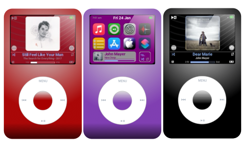
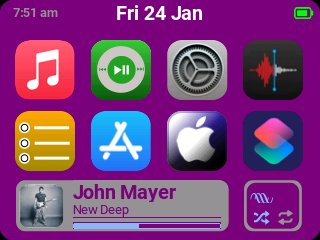
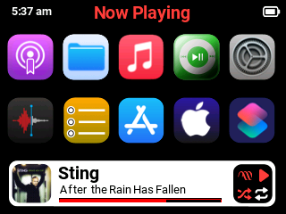
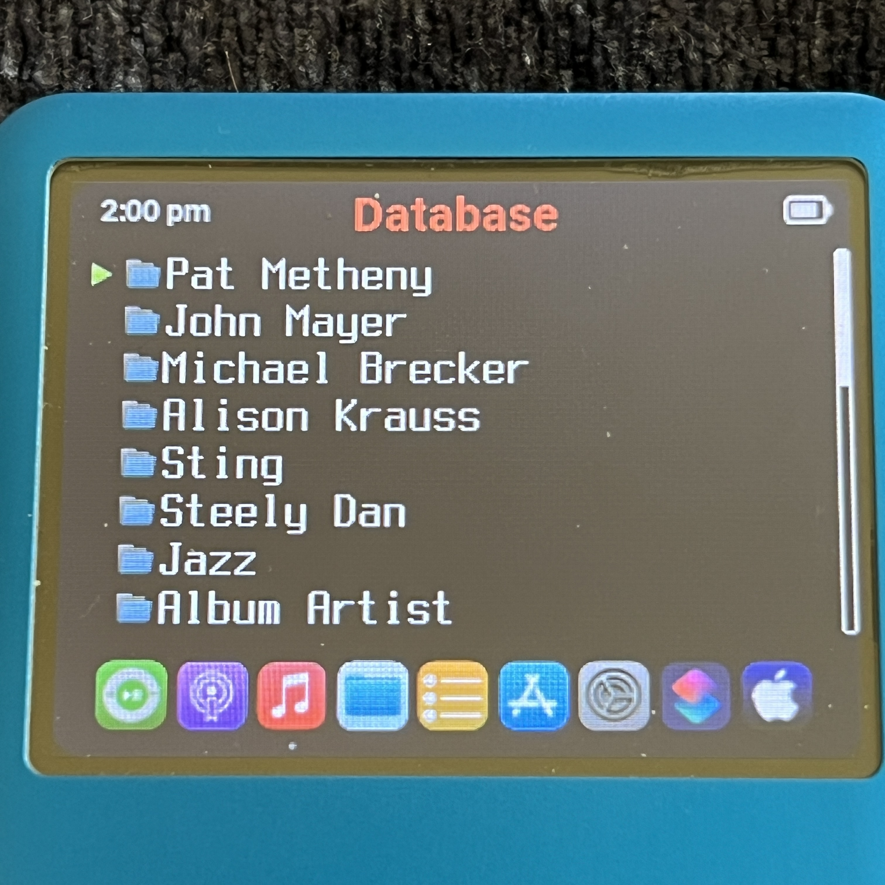
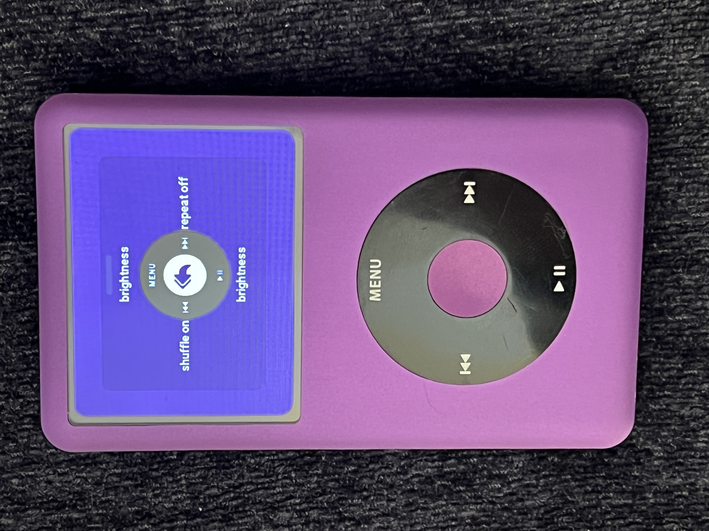
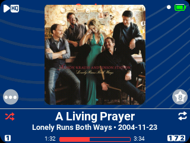
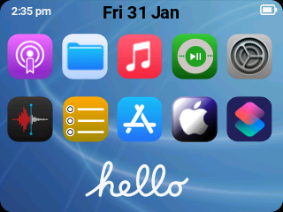

Welcome to Chroma BETA

Chroma is a Rockbox theme built around the idea of giving you extensive color and feature choices. Rather than creating separate themes for light, dark and so on, Chroma gives you nearly unlimited choice over background, foreground, and accent coloration. This is because it uses almost no bitmaps, and the bitmaps that *are* used have an alpha channel. This gives the user thousands of combinations all in the same theme. You can see a superb implementation of the approach in d00k's [Themify](https://github.com/D0-0K/themify).

# Options, Options, Options
In addition to color variety, Chroma makes extensive use of options Shortcuts to give you the ability to turn various features on/off. This is done by accessing the lesser-used settings in Rockbox and reapplying them to various theme settings. I learned of this idea from d00k in his [adwaitapod](https://d00k.net/design/adwaitapod/) series and it is a brilliant way to give the user maximum flexibility in how the theme works for them personnally. 

I tried my best to utilize Rockbox settings that are either rarely used or otherwise won't impact your overall experience. Hopefully you'll agree, and maybe not even notice what was used!

# The Desktop
The sbs screen (which I'm calling the Desktop) is based on tiles, used cleverly in themes like iRetro and [NeoBeat](https://github.com/Dream1iner/NeoBeat). Each tile is connected to a menu item. Unfortunately due to the lack of processing power, Chroma is unable to determine your exactly menu order. BUT I have included three desktop presets (one of them is all 10 menu choices), one of which will hopefully meet your needs. The Desktop also includes a nice "Now Playing" tile that will coordinate with your chosen color scheme. If you have more than one iPod Classic with different color faceplates I think you will really enjoy the variety that Chroma provides.

# miniDock
And as a fun nod to the Mac, I have also included a Mac OS miniDock which you can turn on or off. It even (sort of?) animates up from the bottom of the screen. Might be laggy on the 5th gen, see what you think. I get a kick out of it, but again... you can show it or not. There's also a nod to OS X with an included desktop background. Again... you can show it or not.

# Quickscreen
There is a custom Quickscreen (like you see in d00k's and Dream1iner's great themes). I didn't want to force the quickscreen settings on the user in case you have your own custom quickscreen items chosen. If you want to use Chroma's custom quickscreen, open the cfg file you are currently using (ChromaLight.cfg, for example) and uncomment or add: 

qs top: brightness
qs bottom: brightness
qs left: shuffle
qs right: repeat

This will give you a more pleasant looking Quickscreen. You can experiment with using your own quickscreen settings instead, but you'll need to edit Chroma.sbs. Like the While Playing Screen and the Desktop(sbs), the Quickscreen adapts to any color scheme you choose. And remember... you can access the Shortcuts screen while in the Quickscreen by long-pressing select! So you can show/hide elements easily without having to return to the Desktop.

# Shortcuts drives the experience
As previously mentioned, the user settings are most easily navigated via Shortcuts and I have included a shortcuts file that you can copy from to add to your shortcut file, or if you don't use Shortcuts you could simply replace your Shortcuts file with Chroma's. The file goes in the root of the .rockbox directory. Changes are handled via .cfg files that reside in Chroma Stuff/Settings.

Here is a list of the settings you can change in Chroma:

SBS
* Turn the miniDock on/off
* Switch between showing the menu name of each tile icon or showing the date (coming soon)
* Change the viewport at the top to show the date while on the main desktop
* Change the desktop to use classic blue OS X background
* Switch between color or monochrome tile icons (coming soon)

WPS (While Playing Screen)
* Turn Rounded Album Corners on/off
* Turn Wallpaper (Backdrop) on/off
* Show the Track Counter in play, pause, or turn it off 
* Remove the accent color from the track title
* Show/Hide the the WPS when the hold switch is engaged

# Please don't try to run this on Rockbox 3.15
Get the daily version, please.

# Where to manually install the files

The "Chroma Stuff" folder does NOT go in .rockbox but rather the root of your iPod's storage. This gives you easy access for making changes. All the Chroma shortcuts expect this path, so if you decide to move Chroma Stuff you will need to update the shortcuts. And trust me... using the Shortcuts is key to a great Chroma experience.

The other files go into .rockbox's various directories that bear the same names. So copy the fonts files from Chroma's font directory (don't just drag/drop the folder) and paste those in .rockbox/fonts, copy Chroma.cfg to the themes directory, and so on.

Put shortcuts.txt in .rockbox BUT only if you are going to replace your existing shortcuts.txt! Please don't say I didn't warn you! If you have shortcuts that you use regularly, open Chroma's shortcuts.txt in a text editor, copy all of it, and paste into your shortcut file above/below your existing shortcuts. If you do not have a shortcuts.txt in your .rockbox directory, then you are fine to just drop mine in there. *You NEED to use these shortcuts to properly set up your icons.* And remember to REBOOT after you edit your shortcuts file (or even if you just use mine).

Essential: REBOOT your iPod before you go any further. Otherwise my shortcuts will not be seen. You'll boot into your current non-Chroma theme, but this is fine. We need the shortcuts file to update, which it will after a reboot.

Go to Shortcuts. Choose "Welcome to Chroma" which will launch the default setup. Next, choose one of the three Desktops. They are:

Desktop 1: root menu order: wps, database, files, recording, plugins, playlists, settings, shortcuts,

Desktop 2: root menu order: files, wps, database, playlists, plugins, bookmarks, settings, shortcuts,

Desktop 3: root menu order: bookmarks, files, database, wps, settings, recording, playlists, plugins, system_menu, shortcuts,

Please note that you *must* have Bookmarks enabled to use Layout 2 or 3. Go to Settings, General Settings, Bookmarks to enable. Now your icon should match properly.

#Troubleshooting

Please note that using Chroma's Desktops means your menu items and order *may be altered* so this is your decision to make. It is not difficult to change them back for whatever reason, but I just want to be clear that using Chroma may involve altering your menu items/order. Once you see how easy it is to edit them (you don't need to even use the plugin) you will be customizing in no time.
                                  
Oh, by the way... if you wish to use ratings for your music (they will show in the star) don't forget to go to Database --> Gather Runtime Data --> Yes. Now, when you are listening to a track you can long press the Select button and "Set Song Rating."

# Artwork and info matters

For the While Playing Screen I really tried to prioritize both the artwork (large!) and info without the need for a ton of scrolling. You will be able to quickly see the artist, album, year, file format and bit rate, and (usually) the entire title, artist and album without any scrolling. There is a wallpaper that adapts to your color choices, and I'm even trying to bring back ratings (turn on "Gather Runtime Info" in the Settings to be able to rate your track). And remember, everything is highly customizable, so if you don't like something (like the Wallpaper or track counter) you can in many cases turn it off.

# Create your own Chroma Skins
Finally, a little info about the color-logic. Chroma includes some presets that will get you started, but you will likely want to explore your own color combinations. Similar to the tile icon matching, Chroma does its best to determine your color choices, as Rockbox does not give us the ability to mirror your exact choice. 

The short story is...if the album artwork corners look pefectly rounded, Chroma has determined and matched your color choice. If not, you could still stick with that background color and turn off rounded corners...up to you. Heck you might prefer square album artwork anyway!

In general, steer clear of colors with letters involved if you want rounded corners. If you stick with numbers, you'll have the best chance of matching and having nicely rounded album corners. You can start by editing the included Skins, and saving them as your own custom cfg files. 

For foreground (text elements, mostly) you should also try to use numbers-only but that said, Chroma does look for FFFFFF and F7F7F7 specifically, which will give you some nice accent color options like red or blue. Experiement and see.

SAVE your custom settings by going to Settings--> Manage Settings --> Save Theme Settings. Now you will have your own Chroma look with the options just as YOU prefer. Do this for any other color/feature combinations you like. You can add these to the shortcuts.txt and quickly access them when the mood strikes. Rockbox puts those in .rockbox/themes.

There's still a fair amount to be done, especially work on the lockscreen/usb screen/always on display logic, sleep icons, more. Anyway.....

I hope you enjoy Chroma BETA.

